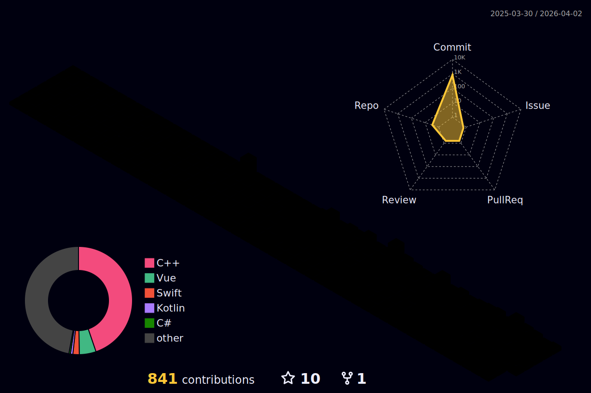

[한국어](./ReadMe_kr.md) 
[Notion](https://www.notion.so/Changjin-Ha-950fb9482888474cb3abef91f714f24d?pvs=4)  

📜Index
=
- [🛠 Techs Stack](#-techs-stack-)
- [🎨 UI Techs Stack](#-ui-techs-stack-)
- [💻 Tools](#-tools-)
- [🖌️ UI Design Tools](#%EF%B8%8F-ui-design-tools-%EF%B8%8F)
- [🧑‍💻 Projects](#-projects-)
- [🌱 Learning, Research](#-learning-research)
- [🏆 Awards](#-awards)
- [📰 Article](#-article)
- [✒️ 논문](#✒️-publications)
- [😊 Contact](#contact-)
- [📈 Statistics](#statistics-) 

🛠 Techs Stack 🛠
=
Techs that I've used at least once 😏

</a>
</a>
</a>
</a>
</a>
</a>
</a>

</a>
</a>
</a>
</a>
</a>
</a>

🎨 UI Techs Stack 🎨
=

</a>
</a>
</a>
</a>
</a>
</a>
</a>

💻 Tools 💻
=

</a>
</a>
</a>
</a>
</a>
</a>
</a>
</a>
</a>
</a>

🖌️ UI Design Tools 🖌️
=

</a>
</a>
</a>
</a>

🧑‍💻 Projects 🧑‍💻
=
Do you want to see my projects? [Go to the link!](./projects/README.md) 

🌱 Learning, Research, Work
=
|Agency|Subject|Period|
|------|------|-----|
|Jeonbuk National University|Dept. of Software Engineering (SWE)|Mar. 2018 - Feb. 2024|
|LG AI Research|2nd Period, LG Aimers|Dec. 2022 - Feb. 2023|
|Jeonbuk National University|Undergraduate Research Student, Smart Biophotonics Lab.|Jan. 2023 - Feb. 2024|
|KOSOMBE|Development of XAI-based Scalp Inspection Software (Changjin Ha, Taesik-Go), Poster Presentation|2023. Spring|
|KIIT|Development of Source Code Evaluation and Similarity Inspection System : Code Odor Detect Assistant([Younsu Nam](https://github.com/namyounsu)* , [Sechang Kim](https://github.com/winersch)* , [Jaehyeon Kim](https://github.com/kiku99)* , [Hyunsu Kim](https://github.com/kimhyun5u)* , Changin Ha* , Sunoh Choi** and Cheoljung Yoo**)|2023. Summer|
|HRDK|Engineer Information Processing Certificate|2023|
|RESKO|Development of mobile applications for diagnosis and rehabilitation of Korean dysarthria (Changjin Ha, Taesik Go)|2023. Fall|
|KOSOMBE|Development of a mobile application for disease prediction and pronunciation correction using speech data of Korean patients with dysarthria (Changjin Ha, Taesik-Go), Poster Presentation|2023. Fall|
|Jeonbuk National University|Aeronautical and drone Software Engineer Course (Micro Degree)|Jan. 2024|
|Jeonbuk National University|BS Graduated, Dept. of Software Engineering|Feb. 2024|
|Applied Sciences|[Intelligent Healthcare Platform for Diagnosis of Scalp and Hair Disorders (Changjin Ha, Taesik Go, Woorak Choi)](https://www.mdpi.com/2076-3417/14/5/1734)|Feb. 2024|
|Journal of Biomedical Engineering Research, KOSOMBE|[Development of a Mobile Application for Disease Prediction Using Speech Data of Korean Patients with Dysarthria (Changjin Ha, Taesik Go)](https://www.kci.go.kr/kciportal/ci/sereArticleSearch/ciSereArtiView.kci?sereArticleSearchBean.artiId=ART003057725)|Feb. 2024|
|Jeonbuk National University Hospital Biomedical Research Institute|BS Researcher|Mar. 2024 - Current|

🏆 Awards
=
|Level|Agency|Subject|Award|
|-----|-----|-----|-----|
|🥇1st|2018.Hackathon@Dept. Software Engineering, Jeonbuk National University|Development of Blue Light Screen Filter to Prevent Smartphone Addiction|Award of President, JBNU, dept. of SWE|
|🥇1st|2019.Hackathon@Div. Computer Engineering, Jeonbuk National University|Development of notification reception system for smartphones on smart TVs|Award of President, JBNU|
|🥉Encouragement Award|2020.K-Hackathon, SWKorea|Development of Training AR Application for Safe Use of Non-drugs for Children (Changjin-Ha, [Yejin-Seo](https://github.com/yejin25), [Hyunjin-Yoo](https://github.com/1hyunjin), Sojung Moon, †Hayeon-Oh(23.06.30.), et al.)|Award of Chairman, SWKorea|
|🥉Encouragement Award|2021.K-Hackathon, SWKorea|Development of Universal Home IoT Device&Service (Changjin-Ha, [Yujee-Chang](https://github.com/yujeecatherine), Hayeong-Lee, Sojung Moon)|Award of President, SWKorea|
|🥈Grand Award|2021. College of Engineering, Jeonbuk National University|Production of promotional video content for Jeonbuk National University College of Engineering (Changjin-Ha, [Yujee-Chang](https://github.com/yujeecatherine), Hayeong-Lee)|Award of President, College of Engineering, Jeonbuk National University|
|🥇 1st|2021. Jeonbuk National University|Production of short-form promotional video content for Joenbuk National University (Changjin-Ha, Hayeong-Lee)|Award of President, Jeonbuk National University|
|🥈Silver Award|2023. Summer, KIIT, Paper Contest for College Students|Development of Source Code Evaluation and Similarity Inspection System : Code Odor Detect Assistant([Younsu Nam](https://github.com/namyounsu)* , [Sechang Kim](https://github.com/winersch)* , [Jaehyeon Kim](https://github.com/kiku99)* , [Hyunsu Kim](https://github.com/kimhyun5u)* , Changin Ha* , Sunoh Choi** and Cheoljung Yoo**)|Silver Award|
|🥇 1st|2023. Fall, RESKO, Paper Contest for College Students|Development of mobile applications for diagnosis and rehabilitation of Korean dysarthria (Changjin Ha, Taesik Go)|Award of President, RESKO|
|🏅 Special Award|2023.K-Hackathon, SWKorea|Development of deep learning-based mobile applications for art psychological diagnosis and treatment of child abuse victims (Changjin-Ha, [Yujee-Chang](https://github.com/yujeecatherine))|Award of Chairman, SWKorea|
|🥈Excellent Award|2023. Jeonbuk Center for Creative Economy & Innovation|Video content production to promote and revitalize youth policies (Changjin-Ha, Jisoo-Park, Hwaram-Park)|Award of President, Jeonbuk Center for Creative Economy & Innovation| 

📰 Article
=
[‘전북대 공대 앱’ 개발한 장경수, 하창진 씨, JB Press Center, 2021](https://www.jbpresscenter.com/news/articleView.html?idxno=501197) 

[“오로지 학생들의 편의를 위해 앱 만들었어요” 전북대 공과대학 앱 제작자, Magazine Hankyung, 2021](https://magazine.hankyung.com/job-joy/amp/202106086136d) 

[숏폼 콘텐츠 공모전, 전홍 팀 총장상 수상, JB Press Center, 2022](https://www.jbpresscenter.com/news/articleView.html?idxno=501903) 

✒️ Publications
=
|Journal|Journal Name|Subject|
|-----|-----|-----|
|Domestic Conference|The Korean Society of Medical & Biological Engineering (Spring, 2023)|Development of XAI-based Scalp Inspection Software (Changjin Ha, Taesik-Go)|
|Domestic Conference|Korean Institute of Information Technology (Summer, 2023)|Development of Source Code Evaluation and Similarity Inspection System : Code Odor Detect Assistant (Younsu Nam, Sechang Kim, Jaehyeon Kim, Hyunsu Kim, Changin Ha, Sunoh Choi and Cheoljung Yoo)|
|Domestic Conference|Rehabilitation Engineering And Assistive Technology Society of Korea (Fall, 2023)|Development of mobile applications for diagnosis and rehabilitation of Korean dysarthria (Changjin Ha, Taesik Go)|
|Domestic Conference|The Korean Society of Medical & Biological Engineering (Fall, 2023)|Development of a mobile application for disease prediction and pronunciation correction using speech data of Korean patients with dysarthria (Changjin Ha, Taesik-Go)|
|International Journal|Applied Sciences|Intelligent Healthcare Platform for Diagnosis of Scalp and Hair Disorders (Changjin Ha, Taesik Go, Woorak Choi)|
|Domestic Journal|Journal of Biomedical Engineering Research, KOSOMBE|Development of a Mobile Application for Disease Prediction Using Speech Data of Korean Patients with Dysarthria (Changjin Ha, Taesik Go)|

Contact? 😊
=
</a>

Statistics 📈
=  

  
  
