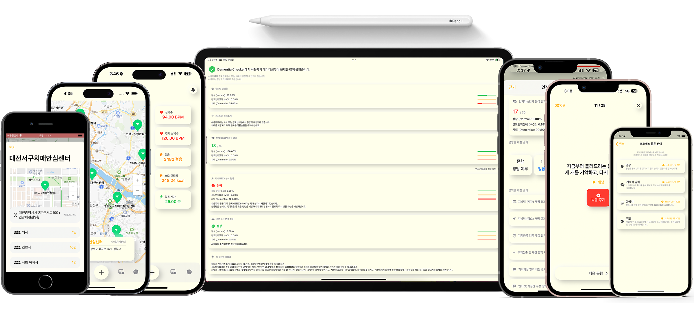
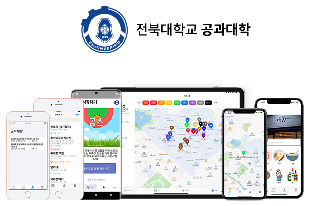

# 🙌🏻 About Me

> **💓 Delivering Warmth through Tech, Proven by Data.**

👋🏻 반가워요! 복잡한 AI 기술을 누구나 쉽게 쓸 수 있는 서비스로 구현하는 개발자, 하창진입니다.

I am a developer who bridges the gap between **Complex AI Models** and **Accessible Mobile Experiences**.

My passion lies in solving real-world problems through technology, specifically in the **Digital Healthcare** sector. I don't just write code; I verify its validity through academic research and quantitative data.

* **Evidence-Based:** My solutions for **Dementia** and **Dysarthria** diagnosis have been validated through **Publications** and recognized with major **Awards**.

* **Full-Cycle Capability:** Proficient in navigating the entire development lifecycle, from **On-Device AI** deployment to **Native Mobile App (iOS/Android)** and **Backend** architecture.

* **Value-Driven:** I strive to build technology that not only functions efficiently but also cares for those in need.

**"Engineering for Humanity"** is the core identity that drives my code.

  

# 📋 Index

- [🛠 Tech Stack](#techStack)
  - [📱 Mobile Application](#mobileApp)
  - [💻 Desktop Application](#desktopApp)
  - [🍃 Web & Backend](#web)
  - [🤖 AI & CV & Game](#ai)
  - [🧱 CS Foundation & Algorithms](#csFoundation)
  - [💻 Tools & Environment](#tools)
  - [🌏 Human Languages](#humanLanguages)
- [🧑‍💻 Projects](#projects)
- [🎓 Education & Certificates](#education)
- [🌱 Experience](#experience)
- [🏆 Awards](#awards)
- [📰 Media Coverage](#media)
- [✒️ Publications](#publications)
- [😊 Contact](#contact)
- [📈 Statistics](#statistics)

# 🛠 Tech Stack

## 🚀 Main Tech Stack

### 📱 Mobile Application

</a>
</a>
</a>

</a>
</a>
</a>
</a>
</a>

### 💻 Desktop Application

</a>
</a>
</a>
</a>
</a>

### 🍃 Web & Backend

    </a>
    </a>
    
    
    
    
    
    </a>
    </a>
    

        </a>
        </a>
        </a>
    

### 🤖 AI & CV & Game

</a>
</a>
</a>
</a>
</a>
</a>
</a>
</a>

### 🧱 CS Foundation & Algorithms

</a>
</a>

### 💻 Tools & Environment

</a>
</a>
</a>
</a>
</a>
</a>
</a>
</a>
</a>
</a>
</a>
</a>

### 🌏 Human Languages

- 🇰🇷 **Korean**: Native
- 🇺🇸 **English**: Professional Working Proficiency (**OPIc IH**)
  - Fluent in Technical Reading & Writing 
- 🇩🇪 **German**: Basic 
- 🇯🇵 **Japanese**: Basic

# 🧑‍💻 Projects

## ✨ Featured Projects

<table width="100%">
    <tr>
        <td align="center" valign="top" width="50%">
             
            

                </a>
                </a>
                </a>
                
                
            
 
            <b>🔬 Romanowsky Stain Slide Analyzer</b> 
            
🙋🻠Role: On-Device AI & Windows App Lead
 
            
        </td>
        <td align="center" valign="top" width="50%">
             
            

                
                 
            
 
            <b>🖥️ SBL Official Website</b> 
            
🙋🻠Role: Full Stack
 
            <a href="https://sbl-web.web.app"> 
            💻 Visit Website</a> 
            
        </td>
    </tr>
    <tr>
        <td align="center" valign="top" width="50%">
             
            

                
                
                
                
            
 
            <b>🧠 Dementia Stage Diagnosis App</b> 
            
🙋🻠Role: Full Stack & On-Device AI Lead
 
            
🥈 Excellent Award (Award of President, KIISE)
 
            
        </td>
        <td align="center" valign="top" width="50%">
             
            

                
                
                
                
                
            
 
            <b>👄 Dysarthria Diagnosis App</b> 
            
🙋🻠Role: Full Stack & On-Device AI Lead
 
            
🥇 1st (Award of President, RESKO)
 
            
🥇 Excellent Paper Award (Award of President, KOSOMBE)
 
            <a href="https://www.kci.go.kr/kciportal/ci/sereArticleSearch/ciSereArtiView.kci?sereArticleSearchBean.artiId=ART003057725"> 
            📄 Paper (Published on Journal of biomedical Engineering Research)</a> 
            
        </td>
    </tr>
    <tr>
        <td align="center" valign="top" width="50%">
             
            

                </a>
                
                
                
            
 
            <b>💇🏻‍♀️ Scalp Inspection SW</b> 
            
🙋🻠Role: Windows App Lead
 
            <a href="https://www.mdpi.com/2076-3417/14/5/1734">
            📄 Paper (Published on Applied Sciences)</a> 
            
        </td>
        <td align="center" valign="top" width="50%">
             
            

                
                
                
                
                
                
            
 
            <b>📱 JBNU Student Council App</b> 
            
🙋🻠Role: Full Stack
 
            
👥 10,000+ Users
 
             
            

                
                
            

        </td>
    </tr>
    <tr>
        <td align="center" valign="top" width="50%">
             
            

                
                
                
                
                
            
 
            <b>🔠Location-based Delivery Fee Splitting Platform</b> 
            
🙋🻠Role: Full Stack
 
             
        </td>
        <td align="center" valign="top" width="50%">
             
            

                
                
                
                
                
                
            
 
            <b>📱 JBNU COE Student Council App</b> 
            
🙋🻠Role: Full Stack
 
            
👥 5,000+ Users
 
             
            

                
                
            

        </td>
    </tr>
</table>

[More Projects...](./projects/README.md) 

# 🎓 Education & Certificates

|Type|Agency|Subject|Period|
|---|------|------|-----|
|🎓 Education|Jeonbuk National University|BS Graduated, Dept. of Software Engineering|Feb. 2024|
|🎓 Education|Jeonbuk National University|Aeronautical and drone Software Engineer Course (Micro Degree)|Jan. 2024|
|🏅 Certificate|ACTFL|OPIc IH|Jan. 2024|
|🏅 Certificate|HRDK|Engineer Information Processing Certificate|2023|
|🎓 Education|LG AI Research|2nd Period, LG Aimers|Dec. 2022 - Feb. 2023|
|🎓 Education|Jeonbuk National University|Dept. of Software Engineering (SWE)|Mar. 2018 - Feb. 2024|

# 🌱 Experience

|Agency|Subject|Period|
|------|------|-----|
|2024 JIANT-Week|Development of a deep learning based mobile application for identifying the severity of cognitive impairment *(**Changjin Ha**, Taesik Go)*, Poster Presentation|Nov. 2024|
|KOSOMBE|Development of a deep learning-based mobile application for early diagnosing dementia *(**Changjin Ha**, Tesik Go)*, Poster Presentation|Nov. 2024|
|Applied Sciences|[Diagnosis of Pressure Ulcer Stage Using On-Device AI *(Yujee Chang, Junhyung Kim, Hyunwoo Shin, **Changjin Ha**, Seungyeob Lee, Taesik Go)*](https://www.mdpi.com/2076-3417/14/16/7124)|Aug. 2024|
|KIISE|Development of a deep learning based mobile application using MMSE, life-log and sleep data for diagnosing dementia stage *(**Changjin Ha**, Taesik Go)*, Poster Presentation|Jun. 2024|
|Jeonbuk National University Hospital Biomedical Research Institute|BS Researcher|Mar. 2024 - Feb. 2025|
|Journal of Biomedical Engineering Research, KOSOMBE|[Development of a Mobile Application for Disease Prediction Using Speech Data of Korean Patients with Dysarthria *(**Changjin Ha**, Taesik Go)*](https://www.kci.go.kr/kciportal/ci/sereArticleSearch/ciSereArtiView.kci?sereArticleSearchBean.artiId=ART003057725)|Feb. 2024|
|Applied Sciences|[Intelligent Healthcare Platform for Diagnosis of Scalp and Hair Disorders *(**Changjin Ha**, Taesik Go, Woorak Choi)*](https://www.mdpi.com/2076-3417/14/5/1734)|Feb. 2024|
|KOSOMBE|Development of a mobile application for disease prediction and pronunciation correction using speech data of Korean patients with dysarthria *(**Changjin Ha**, Taesik Go)*, Poster Presentation|Nov. 2023|
|RESKO|Development of mobile applications for diagnosis and rehabilitation of Korean dysarthria *(**Changjin Ha**, Taesik Go)*|Nov. 2023|
|KIIT|Development of Source Code Evaluation and Similarity Inspection System : Code Odor Detect Assistant *([Younsu Nam](https://github.com/namyounsu) , [Sechang Kim](https://github.com/winersch) , [Jaehyeon Kim](https://github.com/kiku99) , [Hyunsu Kim](https://github.com/kimhyun5u) , **Changjin Ha** * , Sunoh Choi and Cheoljung Yoo)*|Aug. 2023|
|KOSOMBE|Development of XAI-based Scalp Inspection Software *(**Changjin Ha**, Taesik Go)*, Poster Presentation|Apr. 2023|
|Jeonbuk National University|Undergraduate Research Student, Smart Biophotonics Lab.|Jan. 2023 - Feb. 2024|

# 🏆 Awards

|Level|Agency|Subject|Award|
|-----|-----|-----|-----|
|🥇Excellent Paper Award|Journal of Biomedical Engineering Research, KOSOMBE|Development of a Mobile Application for Disease Prediction Using Speech Data of Korean Patients with Dysarthria  *(**Changjin Ha**, Taesik Go)*|Award of President, KOSOMBE|
|🥈Excellent Award|Korea Computer Congress 2024|Development of a deep learning based mobile application using MMSE, life-log and sleep data for diagnosing dementia stage *(**Changjin Ha**, Taesik Go)*|Award of President, KIISE|
|🅠Special Award|2023.K-Hackathon, SWKorea|Development of deep learning-based mobile applications for art psychological diagnosis and treatment of child abuse victims *(**Changjin Ha**, [Yujee Chang](https://github.com/yujeecatherine))*|Award of Chairman, SWKorea|
|🥇 1st|2023. Fall, RESKO, Paper Contest for College Students|Development of mobile applications for diagnosis and rehabilitation of Korean dysarthria *(**Changjin Ha**, Taesik Go)*|Award of President, RESKO|
|🥈Silver Award|2023. Summer, KIIT, Paper Contest for College Students|Development of Source Code Evaluation and Similarity Inspection System : Code Odor Detect Assistant *([Younsu Nam](https://github.com/namyounsu) , [Sechang Kim](https://github.com/winersch) , [Jaehyeon Kim](https://github.com/kiku99) , [Hyunsu Kim](https://github.com/kimhyun5u) , **Changjin Ha** , Sunoh Choi and Cheoljung Yoo)*|Award of President, KIIT|
|🥉Encouragement Award|2021.K-Hackathon, SWKorea|Development of Universal Home IoT Device&Service *(**Changjin Ha**, [Yujee Chang](https://github.com/yujeecatherine), Hayeong Lee)*|Award of President, SWKorea|
|🥉Encouragement Award|2020.K-Hackathon, SWKorea|Development of Training AR Application for Safe Use of Non-drugs for Children *(**Changjin Ha**, [Yejin Seo](https://github.com/yejin25), [Hyunjin Yoo](https://github.com/1hyunjin), †Hayeon Oh)*|Award of Chairman, SWKorea|
|🥇1st|2019.Hackathon@Div. Computer Engineering, Jeonbuk National University|Development of notification reception system for smartphones on smart TVs *(**Changjin Ha**, Yejin Seo, Younyoung Jeong, Younsu Nam)*|Award of President, JBNU|
|🥇1st|2018.Hackathon@Dept. Software Engineering, Jeonbuk National University|Development of Blue Light Screen Filter to Prevent Smartphone Addiction|Award of President, JBNU, dept. of SWE| 

# 📰 Media Coverage

[“오로지 í•™ìƒë“¤ì˜ í¸ì˜ë¥¼ 위해 앱 만들었어요†전ë¶ëŒ€ 공과대학 앱 ì œì‘ì, Magazine Hankyung, 2021](https://magazine.hankyung.com/job-joy/amp/202106086136d) 

[‘전북대 공대 앱’ 개발한 장경수, 하창진 씨, JB Press Center, 2021](https://www.jbpresscenter.com/news/articleView.html?idxno=501197) 

# ✒️ Publications

|Journal|Journal Name|Subject|
|-----|-----|-----|
|Domestic Conference|The Korean Society of Medical & Biological Engineering (Fall, 2024)|Development of a deep learning-based mobile application for early diagnosing dementia (Changjin Ha, Taesik Go)|
|Domestic Conference|KCC 2024|Development of a deep learning based mobile application using MMSE, life-log and sleep data for diagnosing dementia stage (Changjin Ha, Taesik Go)|
|International Journal|Applied Sciences|Diagnosis of Pressure Ulcer Stage Using On-Device AI (Yujee Chang, Junhyung Kim, Hyunwoo Shin, Changjin Ha, Seungyeob Lee, Taesik Go)|
|Domestic Journal|Journal of Biomedical Engineering Research, KOSOMBE|Development of a Mobile Application for Disease Prediction Using Speech Data of Korean Patients with Dysarthria (Changjin Ha, Taesik Go)|
|International Journal|Applied Sciences|Intelligent Healthcare Platform for Diagnosis of Scalp and Hair Disorders (Changjin Ha, Taesik Go, Woorak Choi)|
|Domestic Conference|The Korean Society of Medical & Biological Engineering (Fall, 2023)|Development of a mobile application for disease prediction and pronunciation correction using speech data of Korean patients with dysarthria (Changjin Ha, Taesik Go)|
|Domestic Conference|Rehabilitation Engineering And Assistive Technology Society of Korea (Fall, 2023)|Development of mobile applications for diagnosis and rehabilitation of Korean dysarthria (Changjin Ha, Taesik Go)|
|Domestic Conference|Korean Institute of Information Technology (Summer, 2023)|Development of Source Code Evaluation and Similarity Inspection System : Code Odor Detect Assistant (Younsu Nam, Sechang Kim, Jaehyeon Kim, Hyunsu Kim, Changjin Ha, Sunoh Choi and Cheoljung Yoo)|
|Domestic Conference|The Korean Society of Medical & Biological Engineering (Spring, 2023)|Development of XAI-based Scalp Inspection Software (Changjin Ha, Taesik Go)|

# 😊 Contact

</a>

# 📈 Statistics

