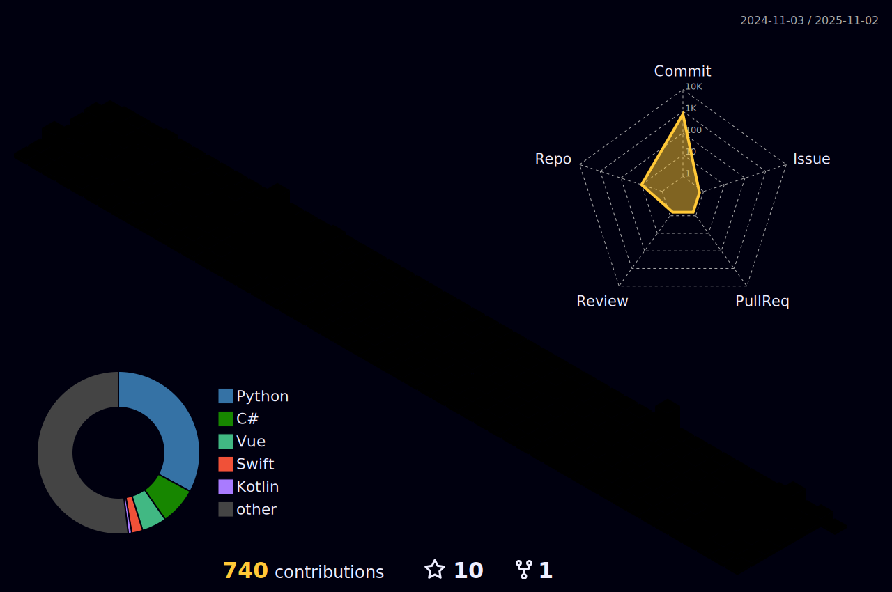

[English](https://github.com/h-ch22/)  

📜README 미리보기📜
=
- [🛠 기술 스텍](#🛠-기술-스택-🛠)
- [💻 도구](#💻-도구-💻)
- [🧑‍💻 프로젝트](#🧑‍💻-프로젝트-🧑‍💻)
- [🌱 학업, 연구](#🌱-학업-연구)
- [🏆 수상](#🏆-수상)
- [📰 기사](#📰-기사)
- [😊 연락하기](#언제든-연락해주세요-😊)
- [📈 통계](#통계-📈) 

🛠 기술 스택 🛠
=
최소 한번 이상의 프로젝트를 진행한 기술들입니다 😏

</a>
</a>
</a>
</a>
</a>
</a>
</a>
</a>
</a>
</a>
</a>
</a>
</a>

💻 도구 💻
=
</a>
</a>
</a>
</a>
</a>
</a>
</a>
</a>

🧑‍💻 프로젝트 🧑‍💻
=
프로젝트들을 보고싶으신가요? [링크를 클릭해보세요!](./projects/README.md) 

🌱 학업, 연구
=
|기관|주제|기간|
|-----------|-----------|----------|
|전북대학교|소프트웨어공학과 (학사 과정)|2018-현재|
|LG AI 연구원|LG Aimers 2기|2022-2023|
|전북대학교|Smart Biophotonics Lab.|2023-현재|
|대한의용생체공학회|설명가능한 인공지능을 활용한 두피 상태 진단 소프트웨어 개발 (하창진, 고태식), Poster Presentation|2023. 춘계|
|한국정보기술학회|소스코드 평가 및 유사도 검사 시스템 : Code Odor Detect Assistant (CODA) 개발([남윤수](https://github.com/namyounsu)* , [김세창](https://github.com/winersch)* , [김재현](https://github.com/kiku99)* , [김현수](https://github.com/kimhyun5u)* , 하창진* , 최선오** , 유철중**)|2023. 하계|
|한국산업인력공단|정보처리기사 취득|2023|
|한국재활복지공학회|한국어 구음장애 진단 및 재활을 위한 모바일 애플리케이션 개발 (하창진, 고태식)|2023. 추계|
|대한의용생체공학회|한국인 구음장애 환자의 발화데이터를 활용한 질병 예측 및 발음 교정을 위한 모바일 애플리케이션 개발 (하창진, 고태식), Poster Presentation|2023. 추계|

🏆 수상
=
|수상 등급|기관|주제|수상|
|---------|----------|----------|---------|
|🥇1위|2018. 전북대학교 소프트웨어공학과 AM:PM 해커톤|스마트폰 중독 예방을 위한 블루라이트 스크린 필터 개발|전북대학교 소프트웨어공학과장상|
|🥇1위|2019. 전북대학교 컴퓨터공학부 해커톤|스마트 TV에서 스마트폰의 알림 수신 및 확인이 가능한 플랫폼 개발|전북대학교 총장상|
|🥉장려상|2020. K-해커톤, 소프트웨어교육혁신센터|아동을 위한 의약외품의 정확한 사용법 교육 AR 애플리케이션 개발 (하창진, [서예진](https://github.com/yejin25), [유현진](https://github.com/1hyunjin), 故오하연(23.06.30.), 그 외.)|소프트웨어교육혁신센터 이사장상|
|🥉장려상|2021. K-해커톤, 소프트웨어교육혁신센터|1인 가구를 위한 통합 IoT 플랫폼 개발 (하창진, [장유지](https://github.com/yujeecatherine), 이하영, 그 외.)|소프트웨어교육혁신센터장상|
|🥈최우수상|2021. 전북대학교 공과대학|공과대학 홍보 영상 컨텐츠 제작 (하창진, [장유지](https://github.com/yujeecatherine), 이하영)|전북대학교 공과대학장상|
|🥇1위|2021. 전북대학교|전북대학교 홍보 숏폼 영상 컨텐츠 제작 (하창진, 이하영)|전북대학교 총장상|
|🥈은상|2023. 춘계, 한국정보기술학회, 대학생 논문 경진대회|소스코드 평가 및 유사도 검사 시스템 : Code Odor Detect Assistant (CODA) 개발([남윤수](https://github.com/namyounsu)* , [김세창](https://github.com/winersch)* , [김재현](https://github.com/kiku99)* , [김현수](https://github.com/kimhyun5u)* , 하창진* , 최선오** , 유철중**)|은상|
|🥇대상|2023. 추계, 한국재활복지공학회, 대학생 논문 경진대회|한국어 구음장애 진단 및 재활을 위한 모바일 애플리케이션 개발 (하창진, 고태식)|대상|
|🏅특별상|2023. K-해커톤, 소프트웨어교육혁신센터|아동 심리 상태 확인 및 공유, 상담을 위한 딥러닝 기반 HTP 검사 서비스(하창진, [장유지](https://github.com/yujeecatherine))|소프트웨어교육혁신센터 이사장상|
|🥈우수상|2023. 전북창조경제혁신센터|전라북도청년정책 홍보 및 활성화를 위한 영상 컨텐츠 제작 (하창진, 박지수, 박화람)|전북창조경제혁신센터장상| 

📰 기사
=
‘전북대 공대 앱’ 개발한 장경수, 하창진 씨, JB Press Center, 2021 
https://www.jbpresscenter.com/news/articleView.html?idxno=501197   

“오로지 학생들의 편의를 위해 앱 만들었어요” 전북대 공과대학 앱 제작자, Magazine Hankyung, 2021 
https://magazine.hankyung.com/job-joy/amp/202106086136d   

숏폼 콘텐츠 공모전, 전홍 팀 총장상 수상, JB Press Center, 2022 
https://www.jbpresscenter.com/news/articleView.html?idxno=501903  

언제든 연락해주세요! 😊
=
</a>

통계 📈
=  

  
  
  
