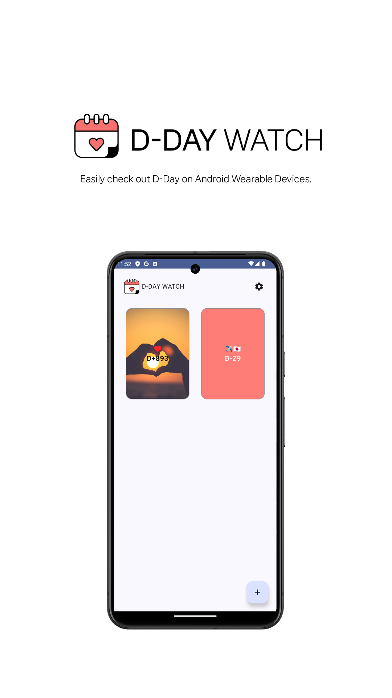

<h1>&nbsp;Changjin Ha</h1> 
<b>&nbsp;👨🏻‍💻 Profile:</b> Full-Stack Developer / Software Engineer 
<b>&nbsp;👨‍🎓 Degree:</b> Feb. 2024 / BS, Software Engineering, Jeonbuk National University  
<b>&nbsp;✉️ E-Mail:</b> ckdwls9460@gmail.com 

<b>&nbsp;🯠Career</b> 

|Company|Position|Period|
|-----|-----|-----|
|Jeonbuk National University Hospital Biomedical Research Institute|BS Researcher|Mar. 2024 - Feb. 2025| 

> **↗️ Redefining Quality through Cutting-Edge Technology.**

I believe that adopting the latest technology is not just about following trends—it's about maximizing performance and user experience.

By boldly embracing modern frameworks like SwiftUI, Jetpack Compose, and On-Device AI, I deliver results that stand apart in stability and polish.

# 🛠 Tech Stack

## 🚀 Main Tech Stack

### 📱 Mobile Application

</a>
</a>
</a>

</a>
</a>
</a>
</a>
</a>

### 💻 Desktop Application

</a>
</a>
</a>
</a>
</a>

### 🍃 Web & Backend

    </a>
    </a>
    
    
    
    
    
    </a>
    </a>
    

        </a>
        </a>
        </a>
    

### 🤖 AI & CV & Game

</a>
</a>
</a>
</a>
</a>
</a>
</a>
</a>

### 🧱 CS Foundation & Algorithms

</a>
</a>

### 💻 Tools & Environment

</a>
</a>
</a>
</a>
</a>
</a>
</a>
</a>
</a>
</a>
</a>
</a>

---

# 📋 Index

- [ MEDi](#medi)
- [ JBNU COE](#jbnu-coe)
- [ 소집 : SOZIP](#sozip)
- [ OFF:IT](#off-it)
- [ 후생관 오더](#hoosaeng-order)
- [ JBNU Student Council](#jbnu-ch)
- [ Scalp Checker](#scalp-checker)
- [ Dysarthria Checker](#dysarthria-checker)
- [ DeepMind](#deep-mind)
- [ Jeonbuk National University SmartBiophotonics Lab.](#sbl-web)
- [ AgingHelper](#aging-helper)
- [ Dementia Checker](#dementia-checker)
- [ D-DAY WATCH](#d-day-watch)
- [ A.MUSE](#a-muse)
- [ Romanowsky Stain Slide Analyzer](#romanowsky-stain-slide-analyzer)
- [ Swirling Checker](#swirling-checker)
- [ SBL Web v2](#sbl-web-v2)

<table>
    <tr>
        <td width="40%" align="center" valign="center">
             
        </td>
        <td width="60%" align="left" valign="top">
         
        <h2>💊 MEDi</h2>
         
        <b>💡 Description</b> 
        Educational applications for correct use of non-drugs for children  
        <b>🛠️ Technologies</b> 
        
        
        
        
        
        
        
          
        <b>🗓️ Period</b> 
        Jun. 2020 - Oct. 2020  
        🯠<b>Results</b> 
        <ul>
        <li>✅ All features implemented</li>
        <li>🥉 Encouragement Award (Award of Chairman, SWKorea), 2020.K-Hackathon, SWKorea</li>
        <li>🚀 Published on Google Play</li>
        </ul>  
        👥 <b>People</b> 
        <b>Changjin Ha</b>, <a href="https://github.com/yejin25">Yejin Seo</a>, <a href="https://github.com/1hyunjin">Hyunjin Yoo</a>, †Hayeon Oh  
        🙋🻠<b>Role</b> 
        <ul>
        <li>iOS & AR Lead, Full Stack</li>
        </ul>  
        📱 <b>Products</b> 
        
        
        
        </td>
    </tr>
</table>

---

<table>
    <tr>
        <td width="40%" align="center" valign="center">
             
        </td>
        <td width="60%" align="left" valign="top">
         
        <h2>📱 JBNU COE</h2>
         
        <b>💡 Description</b> 
        An official mobile application of College of Engineering, Jeonbuk National University Student Council. get notice and welfare for fastest  
        <b>🛠️ Technologies</b> 
        
        
        
        
        
        
        
        
          
        <b>🗓️ Period</b> 
        <ul>
            <li>🗓️ Dec. 2020 - Mar. 2021</li>
            <li>🛠️ Mar. 2021 - Nov. 2021 (Update)</li>
        </ul>  
        🯠<b>Results</b> 
        <ul>
        <li>✅ All features implemented</li>
        <li>📰 <a href="https://www.jbpresscenter.com/news/articleView.html?idxno=501197">전북대 공대 앱’ 개발한 장경수, 하창진 씨, JB Press Center, 2021</a></li>
        <li>📰 <a href="https://magazine.hankyung.com/job-joy/amp/202106086136d">오로지 학생들의 편의를 위해 앱 만들었어요” 전북대 공과대학 앱 제작자, Magazine Hankyung, 2021</a></li>
        <li>👥 5,000+ Users</li>
        </ul>  
        👥 <b>People</b> 
        <b>Changjin Ha</b>  
        🙋🻠<b>Role</b> 
        <ul>
        <li>Full Stack</li>
        </ul>  
        📱 <b>Products</b> 
            
            
            
            
            
        </td>
    </tr>
</table>

---

<table>
    <tr>
        <td width="40%" align="center" valign="center">
             
        </td>
        <td width="60%" align="left" valign="top">
         
        <h2>🍔 소집 : SOZIP</h2>
         
        <b>💡 Description</b> 
        Location-based Delivery Fee Splitting Platform  
        <b>🛠️ Technologies</b> 
        
        
        
        
        
        
          
        <b>🗓️ Period</b> 
        <ul>
            <li>🗓️ Jun. 2021 - Dec. 2021</li>
            <li>🛠️ Apr. 2023 - Jun. 2023 (Update)</li>
        </ul>  
        🯠<b>Results</b> 
        <ul>
        <li>✅ All features implemented</li>
        </ul>  
        👥 <b>People</b> 
        <b>Changjin Ha</b>  
        🙋🻠<b>Role</b> 
        <ul>
        <li>Full Stack</li>
        </ul>  
        📱 <b>Products</b> 
            
            
        </td>
    </tr>
</table>

---

<table>
    <tr>
        <td width="40%" align="center" valign="center">
             
        </td>
        <td width="60%" align="left" valign="top">
         
        <h2>🔌 OFF:IT</h2>
         
        <b>💡 Description</b> 
        An Application for Universal Home IoT Device&Service  
        <b>🛠️ Technologies</b> 
        
        
          
        <b>🗓️ Period</b> 
        <ul>
            <li>🗓️ Jun. 2021 - Oct. 2021</li>
        </ul>  
        🯠<b>Results</b> 
        <ul>
        <li>✅ All features implemented</li>
        <li>🥉 Encouragement Award (Award of President, SWKorea), 2021.K-Hackathon, SWKorea</li>
        </ul>  
        👥 <b>People</b> 
        <b>Changjin Ha</b>, <a href="https://github.com/yujeecatherine">Yujee Chang</a>, Hayeong Lee  
        🙋🻠<b>Role</b> 
        <ul>
        <li>Full Stack</li>
        </ul>
        </td>
    </tr>
</table>

---

<table>
    <tr>
        <td width="40%" align="center" valign="center">
             
        </td>
        <td width="60%" align="left" valign="top">
         
        <h2>🍽️ 후생관 오더</h2>
         
        <b>💡 Description</b> 
        An application for non-face-to-face ordering and issuance of meal vouchers at Jeonbuk National University's student cafeteria  
        <b>🛠️ Technologies</b> 
        
        
          
        <b>🗓️ Period</b> 
        <ul>
            <li>🗓️ Nov. 2021 - Nov. 2021</li>
        </ul>  
        🯠<b>Results</b> 
        <ul>
        <li>✅ All features implemented</li>
        </ul>  
        👥 <b>People</b> 
        <b>Changjin Ha</b>, <a href="https://github.com/yujeecatherine">Yujee Chang</a>, Seunga Park  
        🙋🻠<b>Role</b> 
        <ul>
        <li>Full Stack</li>
        </ul>
        </td>
    </tr>
</table>

---

<table>
    <tr>
        <td width="40%" align="center" valign="center">
             
        </td>
        <td width="60%" align="left" valign="top">
         
        <h2>📱 JBNU Student Council</h2>
         
        <b>💡 Description</b> 
        An official mobile application of Jeonbuk National University Student Council. get notice and welfare for fastest  
        <b>🛠️ Technologies</b> 
        
        
        
        
        
        
        
        
          
        <b>🗓️ Period</b> 
        <ul>
            <li>🗓️ Dec. 2021 - Mar. 2022</li>
            <li>🛠️ Mar. 2022 - Nov. 2022 (Update)</li>
        </ul>  
        🯠<b>Results</b> 
        <ul>
        <li>✅ All features implemented</li>
        <li>🚀 Published on Google Play, Apple App Store</li>
        <li>👥 10,000+ Users</li>
        </ul>  
        👥 <b>People</b> 
        <b>Changjin Ha</b>  
        🙋🻠<b>Role</b> 
        <ul>
        <li>Full Stack</li>
        </ul>  
        📱 <b>Products</b> 
            
            
            
            
        </td>
    </tr>
</table>

---

<table>
    <tr>
        <td width="40%" align="center" valign="center">
             
        </td>
        <td width="60%" align="left" valign="top">
         
        <h2>💇🏻‍♀️ Scalp Checker</h2>
         
        <b>💡 Description</b> 
        Software that uses on-device artificial intelligence to diagnose scalp conditions (dandruff, sebum, erythema, microkeratin, pustule, hair loss)  
        <b>🛠️ Technologies</b> 
        
        
        
        
          
        <b>🗓️ Period</b> 
        <ul>
            <li>🗓️ Jan. 2023 - Mar. 2023</li>
        </ul>  
        🯠<b>Results</b> 
        <ul>
        <li>✅ All features implemented</li>
        <li>📑 Development of XAI-based Scalp Inspection Software (Changjin Ha, Taesik Go), Poster Presentation, KOSOMBE, 2023. Spring</li>
        <li><a href="https://www.mdpi.com/2076-3417/14/5/1734">📑 Intelligent Healthcare Platform for Diagnosis of Scalp and Hair Disorders (Changjin Ha, Taesik Go, Woorak Choi), Applied Sciences, 2024</a></li>
        </ul>  
        👥 <b>People</b> 
        <b>Changjin Ha</b>  
        🙋🻠<b>Role</b> 
        <ul>
        <li>Windows App Lead</li>
        </ul>  
        📱 <b>Products</b> 
            
            
            
        </td>
    </tr>
</table>

---

<table>
    <tr>
        <td width="40%" align="center" valign="center">
             
        </td>
        <td width="60%" align="left" valign="top">
         
        <h2>👄 Dysarthria Checker</h2>
         
        <b>💡 Description</b> 
        A diagnose app for detect dysarthria with ML and Korean vocalization for Korean  
        <b>🛠️ Technologies</b> 
        
        
        
        
        
          
        <b>🗓️ Period</b> 
        <ul>
            <li>🗓️ Jun. 2023 - Aug. 2023</li>
        </ul>  
        🯠<b>Results</b> 
        <ul>
        <li>✅ All features implemented</li>
        <li>🥇 1st (Award of President, RESKO), Development of mobile applications for diagnosis and rehabilitation of Korean dysarthria (Changjin Ha, Taesik Go), Paper Contest for College Students, RESKO, 2023. Fall</li>
        <li>📑 Development of a mobile application for disease prediction and pronunciation correction using speech data of Korean patients with dysarthria (Changjin Ha, Taesik Go), Poster Presentation, KOSOMBE, 2023. Fall</li>
        <li><a href="https://www.kci.go.kr/kciportal/ci/sereArticleSearch/ciSereArtiView.kci?sereArticleSearchBean.artiId=ART003057725">📑 Development of a Mobile Application for Disease Prediction Using Speech Data of Korean Patients with Dysarthria, Journal of Biomedical Engineering Research, Feb. 2024</a></li>
        <li>🥇 Excellent Paper Award (Award of President, KOSOMBE), Development of a Mobile Application for Disease Prediction Using Speech Data of Korean Patients with Dysarthria (Changjin Ha, Taesik Go), Journal of Biomedical Engineering Research, KOSOMBE, 2024</li>
        </ul>  
        👥 <b>People</b> 
        <b>Changjin Ha</b>  
        🙋🻠<b>Role</b> 
        <ul>
        <li>Full Stack & On-Device AI Lead</li>
        </ul>  
        📱 <b>Products</b> 
            
            
        </td>
    </tr>
</table>

---

<table>
    <tr>
        <td width="40%" align="center" valign="center">
             
        </td>
        <td width="60%" align="left" valign="top">
         
        <h2>🧠 Deep Mind</h2>
         
        <b>💡 Description</b> 
        On-device AI-based HTP testing and real-time consultation application  
        <b>🛠️ Technologies</b> 
        
        
        
        
        
        
        
          
        <b>🗓️ Period</b> 
        <ul>
            <li>🗓️ Jun. 2023 - Oct. 2023</li>
        </ul>  
        🯠<b>Results</b> 
        <ul>
        <li>✅ All features implemented</li>
        <li>🏅 Special Award (Award of Chairman, SWKorea), 2023. K-Hackathon, SWKorea</li>
        </ul>  
        👥 <b>People</b> 
        <b>Changjin Ha</b>, <a href="https://github.com/yujeecatherine">Yujee Chang</a>  
        🙋🻠<b>Role</b> 
        <ul>
        <li>Full Stack & On-Device AI Lead</li>
        </ul>  
        📱 <b>Products</b> 
            
            
        </td>
    </tr>
</table>

---

<table>
    <tr>
        <td width="40%" align="center" valign="center">
             
        </td>
        <td width="60%" align="left" valign="top">
         
        <h2>🖥️ SBL Web</h2>
         
        <b>💡 Description</b> 
        An official website for Smart Biophotonics Lab., Jeonbuk National University  
        <b>🛠️ Technologies</b> 
        
        
          
        <b>🗓️ Period</b> 
        <ul>
            <li>🗓️ Nov. 2023 - Nov. 2023</li>
        </ul>  
        🯠<b>Results</b> 
        <ul>
        <li>✅ All features implemented</li>
        <li>🚀 Published</li>
        </ul>  
        👥 <b>People</b> 
        <b>Changjin Ha</b>  
        🙋🻠<b>Role</b> 
        <ul>
        <li>Full Stack</li>
        </ul>  
        📱 <b>Products</b> 
            
            
        </td>
    </tr>
</table>

---

<table>
    <tr>
        <td width="100%" align="left" valign="top">
         
        <h2><s>👴🏻 Aging Helper</s> (Deprecated)</h2>
         
        <b>💡 Description</b> 
        A mobile application that uses on-device AI to predict a person's future or past appearance.  
        <b>🛠️ Technologies</b> 
        
        
          
        <b>🗓️ Period</b> 
        <ul>
            <li>🗓️ Dec. 2023 - Dec. 2023</li>
        </ul>  
        🯠<b>Results</b> 
        <ul>
        <li>❌ Deprecated <i>(Reason: Low Accuracy, too large model, Model is not compatible with Torchscript)</i></li>
        </ul>  
        👥 <b>People</b> 
        <b>Changjin Ha</b>  
        🙋🻠<b>Role</b> 
        <ul>
        <li>Full Stack & On-Device AI Lead</li>
        </ul>  
        📱 <b>Products</b> 
            
        </td>
    </tr>
</table>

---

<table>
    <tr>
        <td width="40%" align="center" valign="center">
             
        </td>
        <td width="60%" align="left" valign="top">
         
        <h2>🧠 Dementia Checker</h2>
         
        <b>💡 Description</b> 
        Deep learning-based dementia diagnosis application using intelligence test, sleep, and lifestyle data  
        <b>🛠️ Technologies</b> 
        
        
        
        
          
        <b>🗓️ Period</b> 
        <ul>
            <li>🗓️ Jan. 2024 - Feb. 2024</li>
        </ul>  
        🯠<b>Results</b> 
        <ul>
        <li>✅ All features implemented</li>
        <li>🥈 Excellent Award (Award of President, KIISE), Development of a deep learning based mobile application using MMSE, life-log and sleep data for diagnosing dementia stage <i>(Changjin Ha, Taesik Go)</i>, Korea Computer Congress 2024, KIISE</li>
        </ul>  
        👥 <b>People</b> 
        <b>Changjin Ha</b>  
        🙋🻠<b>Role</b> 
        <ul>
        <li>Full Stack & On-Device AI Lead</li>
        </ul>  
        📱 <b>Products</b> 
            
            
        </td>
    </tr>
</table>

---

<table>
    <tr>
        <td width="40%" align="center" valign="center">
             
        </td>
        <td width="60%" align="left" valign="top">
         
        <h2>🗓️ D-DAY WATCH</h2>
         
        <b>💡 Description</b> 
        Check your own D-Day on wearOS  
        <b>🛠️ Technologies</b> 
        
        
        
          
        <b>🗓️ Period</b> 
        <ul>
            <li>🗓️ May. 2024 - Jun. 2024</li>
        </ul>  
        🯠<b>Results</b> 
        <ul>
        <li>✅ All features implemented</li>
        <li>🚀 Published on Google Play</li>
        </ul>  
        👥 <b>People</b> 
        <b>Changjin Ha</b>  
        🙋🻠<b>Role</b> 
        <ul>
        <li>Full Stack</li>
        </ul>  
        📱 <b>Products</b> 
            
            
        </td>
    </tr>
</table>

---

<table>
    <tr>
        <td width="40%" align="center" valign="center">
             
        </td>
        <td width="60%" align="left" valign="top">
         
        <h2>📖 A.MUSE</h2>
         
        <b>💡 Description</b> 
        A complex cultural experience solution using XR technology  
        <b>🛠️ Technologies</b> 
        
        
        
        
        
          
        <b>🗓️ Period</b> 
        <ul>
            <li>🗓️ Jul. 2024 - Sep. 2024</li>
        </ul>  
        🯠<b>Results</b> 
        <ul>
        <li>✅ All features implemented</li>
        </ul>  
        👥 <b>People</b> 
        <b>Changjin Ha</b>, Hwaram Park, Jisoo Park  
        🙋🻠<b>Role</b> 
        <ul>
        <li>Full Stack</li>
        </ul>  
        📱 <b>Products</b> 
            
            
        </td>
    </tr>
</table>

---

<table>
    <tr>
        <td width="40%" align="center" valign="center">
             
        </td>
        <td width="60%" align="left" valign="top">
         
        <h2>🔬 Romanowsky Stain Slide Analyzer</h2>
         
        <b>💡 Description</b> 
        Segmentation & Labeling Tool for Data Training and Verification Exclusive to Romanowsky Stain Slide Analyzer, Powered by SAM  
        <b>🛠️ Technologies</b> 
        
        
        </a>
        
        
          
        <b>🗓️ Period</b> 
        <ul>
            <li>🗓️ Nov. 2024 - Jan. 2025</li>
        </ul>  
        🯠<b>Results</b> 
        <ul>
        <li>✅ All features implemented</li>
        </ul>  
        👥 <b>People</b> 
        <b>Changjin Ha</b>  
        🙋🻠<b>Role</b> 
        <ul>
        <li>Full Stack & On-Device AI Lead</li>
        </ul>  
        📱 <b>Products</b> 
            
        </td>
    </tr>
</table>

---

<table>
    <tr>
        <td width="40%" align="center" valign="center">
             
        </td>
        <td width="60%" align="left" valign="top">
         
        <h2>🩸 Swirling Checker</h2>
         
        <b>💡 Description</b> 
        Detect the swirling phenomenon of liquid using OpenCV  
        <b>🛠️ Technologies</b> 
        
        
        
        
          
        <b>🗓️ Period</b> 
        <ul>
            <li>🗓️ Jan. 2025 - Jan. 2025</li>
        </ul>  
        🯠<b>Results</b> 
        <ul>
        <li>✅ All features implemented</li>
        </ul>  
        👥 <b>People</b> 
        <b>Changjin Ha</b>  
        🙋🻠<b>Role</b> 
        <ul>
        <li>Full Stack</li>
        </ul>  
        📱 <b>Products</b> 
            
        </td>
    </tr>
</table>

---

<table>
    <tr>
        <td width="40%" align="center" valign="center">
             
        </td>
        <td width="60%" align="left" valign="top">
         
        <h2>🖥️ SBL Web v2</h2>
         
        <b>💡 Description</b> 
        An official website for Smart Biophotonics Lab., Jeonbuk National University. Fast, stable, and beautiful, rebuilt with Vue  
        <b>🛠️ Technologies</b> 
        
          
        <b>🗓️ Period</b> 
        <ul>
            <li>🗓️ Sep. 2025 - Oct. 2025</li>
        </ul>  
        🯠<b>Results</b> 
        <ul>
        <li>✅ All features implemented</li>
        <li>🚀 Published</li>
        </ul>  
        👥 <b>People</b> 
        <b>Changjin Ha</b>  
        🙋🻠<b>Role</b> 
        <ul>
        <li>Full Stack</li>
        </ul>  
        📱 <b>Products</b> 
            
            
        </td>
    </tr>
</table>
