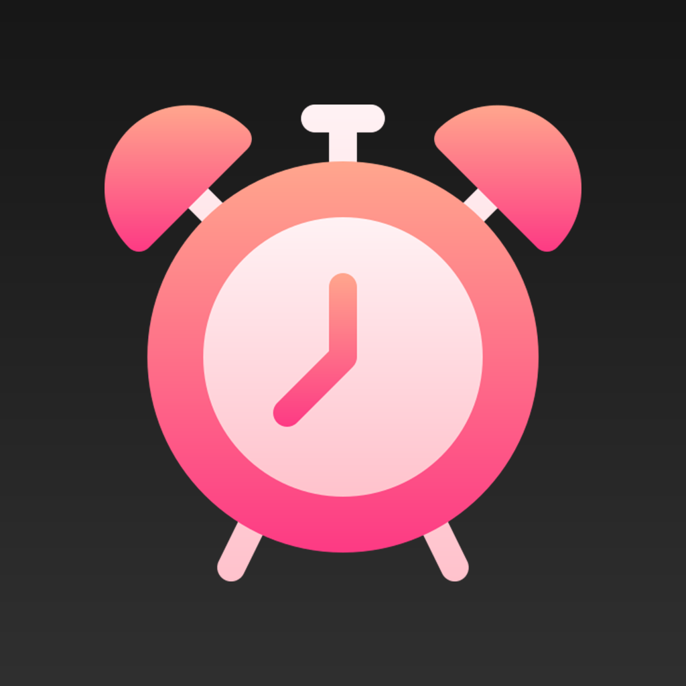
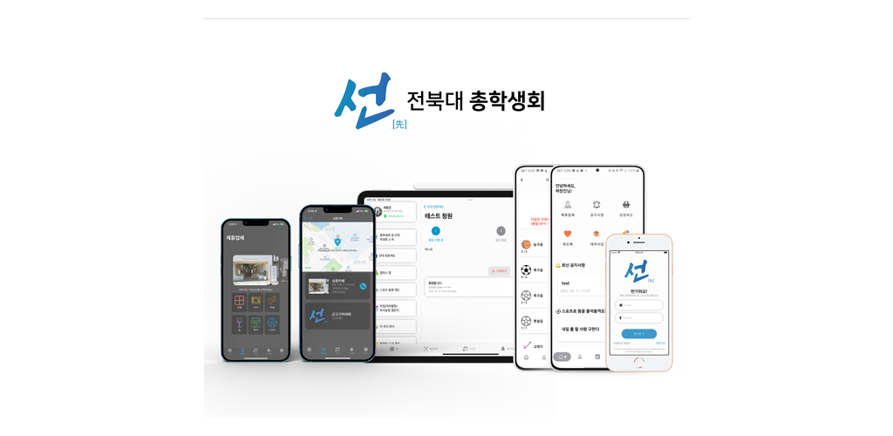

<h1>&nbsp;Changjin Ha</h1> 
<b>&nbsp;👨🏻‍💻 Profile:</b> Full-Stack Developer / Software Engineer 
<b>&nbsp;👨‍🎓 Degree:</b> Feb. 2024 / BS, Software Engineering, Jeonbuk National University  
<b>&nbsp;🯠Current:</b> Mar. 2024 - / BS Researcher, Jeonbuk National University Hospital Biomedical Research Institute 
<b>&nbsp;✉️ E-Mail:</b> ckdwls9460@gmail.com 
<h2>&nbsp;🛠 SKILLS</h2>

</a>
</a>
</a>
</a>
</a>
</a>
</a>

</a>
</a>
</a>
</a>
</a>
</a>
</a>
</a>
</a>
</a>
</a>
</a>
</a>

___

📜Index
=
- [ MEDi](#medi)
- [ JBNU COE](#jbnu-coe)
- [ 소집 : SOZIP](#소집--sozip)
- [ OFF:IT](#offit)
- [ 후생관 오더](#후생관-오더)
- [ JBNU Student Council](#jbnu-student-council)
- [ GT: Go Together](#gt-go-together-outsourcing)
- [ Scalp Checker](#scalp-checker)
- [ Dysarthria Checker](#dysarthria-checker)
- [ DeepMind](#deepmind)
- [ Jeonbuk National University SmartBiophotonics Lab.](#jeonbuk-national-university-smart-biophotonics-lab)
- [ AgingHelper](#aginghelper)
- [ Dementia Checker](#dementia-checker)
- [ A.MUSE](#amuse)
- [ Endoscopy Checker](#endoscopy-checker)
- [ Wake Me!](#wake-me)
- [ Romanowsky Stain Slide Analyzer](#romanowsky-stain-slide-analyzer-for-windows)
- [ Swirling Checker](#swirling-checker)

 
 
MEDi 
=
> Educational applications for correct use of non-drugs for children 

## 🛠️ Technologies

 

## 🗓️ Period
🗓️ <b>2020.06 ~ 2020.10. 

## ☑️ Results
☑️ <b>Done for all features 
🥉 <b>Encouragement Award (Award of Chairman, SWKorea), 2020.K-Hackathon, SWKorea 
☑️ <b>Published on Google Play 

## 👩‍👧‍👦 People
Changjin-Ha, [Yejin-Seo](https://github.com/yejin25), [Hyunjin-Yoo](https://github.com/1hyunjin), Sojung Moon, †Hayeon-Oh(23.06.30.), et al. 

## 📱 Products

</a>

- - -

 
 
JBNU COE 
=
> An official mobile application of College of Engineering, Jeonbuk National University Student Council. get notice and welfare for fastest 

## 🛠️ Technologies

 

## 🗓️ Period
🗓️ <b>2020.12 ~ 2021.03. 
🛠️ <b>2021.03. ~ 2021.11. (Update) 

## ☑️ Results
☑️ <b>Done for all features 
☑️ <b>The first official student council application in Korea 
☑️ <b>Published on Google Play, Apple AppStore 
📰 [‘전북대 공대 앱’ 개발한 장경수, 하창진 씨, JB Press Center, 2021](https://www.jbpresscenter.com/news/articleView.html?idxno=501197) 

📰 [“오로지 학생들의 편의를 위해 앱 만들었어요” 전북대 공과대학 앱 제작자, Magazine Hankyung, 2021](
https://magazine.hankyung.com/job-joy/amp/202106086136d) 

## 👩‍👧‍👦 People
Changjin-Ha 

## 📱 Products

- - -
 
 
소집 : SOZIP 
=
> An application for Delivery Cost Dutch Pay 

## 🛠️ Technologies

 

## 🗓️ Period
🗓️ <b>2021.06 ~ 2021.12. 
🛠️ <b>2023.04. ~ 2023.06. (Update) 

## ☑️ Results
☑️ <b>Done for all features 

## 👩‍👧‍👦 People
Changjin-Ha, Sojung Moon 

## 📱 Products

- - -
 
 
OFF:IT 
=
> An Application for Universal Home IoT Device&Service 

## 🛠️ Technologies

 

## 🗓️ Period
🗓️ <b>2021.06 ~ 2021.10. 

## ☑️ Results
☑️ <b>Done for all features 
🥉 <b>Encouragement Award (Award of President, SWKorea), 2021.K-Hackathon, SWKorea 

## 👩‍👧‍👦 People
Changjin-Ha, [Yujee-Chang](https://github.com/yujeecatherine), Hayeong-Lee, Sojung Moon  

- - -
 
 
후생관 오더 
=
> An application for non-face-to-face ordering and issuance of meal vouchers at Jeonbuk National University's student cafeteria 

## 🛠️ Technologies

 

## 🗓️ Period
🗓️ <b>2021.11 ~ 2021.11. 

## ☑️ Results
☑️ <b>Done for all features 

## 👩‍👧‍👦 People
Changjin-Ha, [Yujee-Chang](https://github.com/yujeecatherine), Seunga-Park.  

- - -

 
 
JBNU Student Council 
=
> An official mobile application of Jeonbuk National University Student Council. get notice and welfare for fastest 

## 🛠️ Technologies

 

## 🗓️ Period
🗓️ <b>2021.12 ~ 2022.03. 
🛠️ <b>2022.03. ~ 2022.11. (Update) 

## ☑️ Results
☑️ <b>Done for all features 
☑️ <b>Published on Google Play, Apple App Store 

## 👩‍👧‍👦 People
Changjin-Ha 

## 📱 Products

- - -

 
 
GT: Go Together (OutSourcing) 
=
> Global Smart Farm Sculpture Investment 

## 🛠️ Technologies

 

## 🗓️ Period
🗓️ <b>2022.12 ~ 2023.03. 

## ☑️ Results
☑️ <b>Done for all features 
☑️ <b>Published on Google Play, Apple App Store 

## 👩‍👧‍👦 People
Changjin-Ha 

## 📱 Products

- - -

 
 
Scalp Checker 
=
> Check your Scalp Health with Scalp Checker 

## 🛠️ Technologies

 

## 🗓️ Period
🗓️ <b>2023.01. ~ 2023.03. 

## ☑️ Results
☑️ <b>Done for all features 
📑 <b>Development of XAI-based Scalp Inspection Software (Changjin Ha, Taesik-Go), Poster Presentation, KOSOMBE, 2023. Spring 
📑 <b>[Intelligent Healthcare Platform for Diagnosis of Scalp and Hair Disorders (Changjin Ha, Taesik Go, Woorak Choi), Applied Sciences, 2024](https://www.mdpi.com/2076-3417/14/5/1734) 

## 👩‍👧‍👦 People
Changjin-Ha 

## 📱 Products

- - -

 
 
Dysarthria Checker 
=
> A diagnose app for detect dysarthria with ML and Korean vocalization for Korean 

## 🛠️ Technologies

 

## 🗓️ Period
🗓️ <b>2023.06. ~ 2023.08. 

## ☑️ Results
☑️ <b>Done for all features 
🥇 <b>1st (Award of President, RESKO), Development of mobile applications for diagnosis and rehabilitation of Korean dysarthria (Changjin Ha, Taesik Go), Paper Contest for College Students, RESKO, 2023. Fall 
📑 <b>Development of a mobile application for disease prediction and pronunciation correction using speech data of Korean patients with dysarthria (Changjin Ha, Taesik-Go), Poster Presentation, KOSOMBE, 2023. Fall 
📑 <b>[Development of a Mobile Application for Disease Prediction Using Speech Data of Korean Patients with Dysarthria, Journal of Biomedical Engineering Research, Feb. 2024](https://www.kci.go.kr/kciportal/ci/sereArticleSearch/ciSereArtiView.kci?sereArticleSearchBean.artiId=ART003057725) 
🥇 <b>Excellent Paper Award (Award of President, KOSOMBE), Development of a Mobile Application for Disease Prediction Using Speech Data of Korean Patients with Dysarthria (Changjin Ha, Taesik Go), Journal of Biomedical Engineering Research, KOSOMBE, 2024 	

## 👩‍👧‍👦 People
Changjin-Ha 

## 📱 Products

- - -

 
 
DeepMind 
=
> Check your psychological status with ML. 

## 🛠️ Technologies

 

## 🗓️ Period
🗓️ <b>2023.06. ~ 2023.10. 

## ☑️ Results
☑️ <b>Done for all features 
🅠<b>Special Award (Award of Chairman, SWKorea), 2023. K-Hackathon, SWKorea 
## 👩‍👧‍👦 People
Changjin-Ha, [Yujee-Chang](https://github.com/yujeecatherine) 

## 📱 Products

- - -

 
 
Jeonbuk National University Smart Biophotonics Lab. 
=
> An official website for Smart Biophotonics Lab., Jeonbuk National University 

## 🛠️ Technologies

 

## 🗓️ Period
🗓️ <b>2023.11. ~ 2023.11. 

## ☑️ Results
☑️ <b>Done for all features 
☑️ <b>Published 

## 👩‍👧‍👦 People
Changjin-Ha 

## 📱 Products

- - -

 
AgingHelper 
=
> Use ML to preview the future of your precious person or provide improved facial recognition. 

## 🛠️ Technologies

 

## 🗓️ Period
🗓️ <b>2023.12. ~ 2023.12. 

## ☑️ Results
✖️ <b>Deprecated (Reason: Low Accuracy, too large model, Model does not compatible with Torchscript) 

## 👩‍👧‍👦 People
Changjin-Ha 

## 📱 Products

- - -

 
 
Dementia Checker 
=
> Deep learning-based dementia diagnosis application using intelligence test, sleep, and lifestyle data 

## 🛠️ Technologies

 

## 🗓️ Period
🗓️ <b>2024.01. ~ 2024.02. 

## ☑️ Results
☑️ <b>Done for all features 
🥈 <b>Excellent Award (Award of President, KIISE), Development of a deep learning based mobile application using MMSE, life-log and sleep data for diagnosing dementia stage (Changjin Ha, Taesik Go), Korea Computer Congress 2024, KIISE</b>
## 👩‍👧‍👦 People
Changjin-Ha 

## 📱 Products
[iOS/iPadOS Source Code (Private)](https://github.com/h-ch22/DementiaChecker_iOS)
[DeepLearning Source Code (Private)](https://github.com/h-ch22/DementiaChecker_ML) 

- - -

 
 
A.MUSE 
=
> A complex cultural experience solution using XR technology 

## 🛠️ Technologies

 

## 🗓️ Period
🗓️ <b>2024.07. ~ 2024.09. 

## ☑️ Results
☑️ <b>Done for all features 

## 👩‍👧‍👦 People
Changjin-Ha, Hwaram-Park, Jisoo-Park 

## 📱 Products

- - -

 
 
Endoscopy Checker 
=
> Deep learning-based cancer, pressure ulcer, ulcer detection and patient-communication applications in endoscopic images or videos 

## 🛠️ Technologies

 

## 🗓️ Period
🗓️ <b>2024.10. ~ Current 

## ☑️ Results
➡️ <b>In Progress 

## 👩‍👧‍👦 People
Changjin-Ha 

## 📱 Products

- - -

 
 
Wake Me! 
=
> Application that provides alarm missions through image comparison based on deep learning and solves math problems. 

## 🛠️ Technologies

 

## 🗓️ Period
🗓️ <b>2024.11. ~ Current 

## ☑️ Results
➡️ <b>In Progress 

## 👩‍👧‍👦 People
Changjin-Ha 

## 📱 Products

- - -

 
 
Romanowsky Stain Slide Analyzer for Windows 
=
> Segmentation & Labeling Tool for Data Training and Verification Exclusive to Romanowsky Stain Slide Analyzer, Powered by SAM 

## 🛠️ Technologies

 

## 🗓️ Period
🗓️ <b>2024.11. ~ 2025.01. 

## ☑️ Results
☑️ <b>Done for all features 

## 👩‍👧‍👦 People
Changjin-Ha 

## 📱 Products

- - -

 
 
Swirling Checker 
=
> Detect the swirling phenomenon of liquid using OpenCV. 

## 🛠️ Technologies

 

## 🗓️ Period
🗓️ <b>2025.01. ~ 2025.01. 

## ☑️ Results
☑️ <b>Done for all features 

## 👩‍👧‍👦 People
Changjin-Ha 

## 📱 Products

